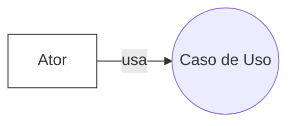

# Click Health — Diagrama de Casos de Uso

## 0) O que é um Diagrama de Casos de Uso (UML) e para que serve
Um **Diagrama de Casos de Uso** modela o que o sistema oferece aos atores, mostrando funcionalidades observáveis e o limite do sistema. Ajuda a alinhar stakeholders, definir escopo e orientar testes de aceitação.
**Como foi feito:** aplicamos essa definição ao contexto do Click Health para guiar escolhas de atores e casos.

## 1) Referências utilizadas (base do diagrama)
- Documento do projeto Click Health: Perfis, Histórias, RF-01…RF-10, RNF, Justificativa e Metodologia.
- Boas práticas de UML: uso de `<<include>>`/`<<extend>>`.
- Contexto de saúde: coordenação do cuidado, notificações, auditoria.
**Como foi feito:** extraímos entidades e funcionalidades do documento e validamos com boas práticas UML.

## 2) Atores
- Cuidador Familiar Principal — administra pacientes, acessos e configurações.
- Cuidador de Apoio — executa tarefas delegadas e registra ocorrências.
- Cuidador Profissional — registra evolução clínica e execução de rotinas.
- Paciente (ator secundário/indireto) — pode visualizar agenda/notificações quando aplicável.
- Serviço de Notificações (externo/opcional) — e-mail/SMS/push.
**Como foi feito:** derivamos dos Perfis de Usuário e da integração de notificações.

## 3) Como o diagrama foi construído (rastreabilidade)
1. Perfis → atores.
2. Histórias → macrofunções (CRUD, Permissões, Agenda/Medicação, Notificações, Histórico, Feed, Auditoria, Autenticação, Relatórios).
3. RF-01…RF-10 → casos de uso correspondentes.
4. `include`/`extend` → subfunções obrigatórias e comportamentos condicionais.
5. Associação atores ↔ casos.
6. Notas de projeto (auditoria, concorrência, escopo).
**Como foi feito:** garantimos rastreabilidade RF ↔ História ↔ Caso de uso.

## 4) Casos de Uso (resumo)
### Autenticação e Acesso
- Autenticar-se (todos)
- Gerenciar Convites e Acessos (inclui: Enviar Convite, Definir Permissões, Revogar Acesso)
- Consultar Log de Auditoria
### Gestão de Pacientes
- Gerenciar Pacientes (CRUD) (inclui: Cadastrar, Editar, Excluir, Consultar)
- Exportar/Emitir Relatório do Paciente
### Agenda, Tarefas e Notificações
- Gerenciar Agenda do Paciente (inclui: Agendar Consulta, Agendar Exame, Planejar Medicação, Lembretes de Reposição/Compra)
- Receber Notificações/Alertas (estende: Gerenciar Agenda)
- Marcar Tarefa como Concluída
### Registros Clínicos e Comunicação
- Registrar Histórico Clínico (inclui: Anexar Exame, Registrar Ocorrência, Atualizar Medicações)
- Visualizar Feed de Atualizações
**Como foi feito:** agrupamos por objetivo e detalhamos subcasos com `include`/`extend`.

## Sobre Mermaid e PlantUML
**Visão geral (para quem está começando):**
- **Mermaid** é uma linguagem de diagramas em Markdown. O GitHub renderiza automaticamente o diagrama quando você abre o `.md`. Ótima para documentação rápida e colaboração, sem instalar nada. Limitação: não é UML “pura” — certos conceitos (ex.: `<<include>>`/`<<extend>>`) precisam ser representados de forma aproximada.
- **PlantUML** é uma linguagem textual pensada para **UML**. É forte em precisão semântica (tem `<<include>>` e `<<extend>>` nativos) e gera **PNG/SVG** de alta qualidade. Precisa de um renderizador (VS Code + extensão, site ou linha de comando).

**Quando usar qual?**
- Use **Mermaid** quando quiser um `.md` que renderiza direto no GitHub.
- Use **PlantUML** quando precisar de fidelidade UML e imagens para relatório/Canva.

**Como renderizar**
- **Mermaid**: mantenha o bloco ```mermaid em um `.md`. Para baixar PNG/SVG, use o **Mermaid Live Editor** (cole o código e exporte).
- **PlantUML**: abra o `.puml` no VS Code com a extensão PlantUML e use *Export*; ou use o site oficial/CLI para gerar PNG/SVG.

**Armadilhas comuns**
- Mermaid: sempre use cercas de código ` ```mermaid ` e defina a direção (`flowchart LR|TD`). Evite temas que o GitHub não reconheça.
- PlantUML: comece com `@startuml` e termine com `@enduml`; use alias (ex.: `as A1`) para nomes com espaço; `extend` usa `UC_A <|.. UC_B`.

**Mini‑cheatsheet**
Mermaid (use‑case via flowchart):


PlantUML (básico + include/extend):
```plantuml
@startuml
actor "Usuário" as U
usecase UC as "Autenticar-se"
U -- UC

UC_A <<include>> UC_B
UC_C <|.. UC_D : <<extend>>
@enduml
```
## 5) Diagramas
### 5.1 Mermaid
```mermaid
flowchart LR
  A1["Cuidador Familiar Principal"]:::actor
  A2["Cuidador de Apoio"]:::actor
  A3["Cuidador Profissional"]:::actor
  A4["Paciente (indireto)"]:::actor
  Ext["Serviço de Notificações"]:::external

  UC_auth((Autenticar-se))
  UC_access((Gerenciar Convites e Acessos))
  UC_crud((Gerenciar Pacientes (CRUD)))
  UC_agenda((Gerenciar Agenda do Paciente))
  UC_notify((Receber Notificações/Alertas))
  UC_task((Marcar Tarefa como Concluída))
  UC_hist((Registrar Histórico Clínico))
  UC_feed((Visualizar Feed de Atualizações))

  A1 --- UC_auth
  A2 --- UC_auth
  A3 --- UC_auth
  A1 --- UC_access
  A1 --- UC_crud
  A1 --- UC_agenda
  A2 --- UC_task
  A2 --- UC_feed
  A2 --- UC_notify
  A3 --- UC_hist
  A3 --- UC_task
  A3 --- UC_feed
  A3 --- UC_notify
  A4 --- UC_notify
  A4 --- UC_feed
  Ext --- UC_notify

  UC_agenda -.dispara.-> UC_notify

  classDef actor fill:#fff,stroke:#333,stroke-width:1px
  classDef external fill:#f8f8f8,stroke:#888,stroke-dasharray:3 3
```
### 5.2 PlantUML
```plantuml
@startuml
left to right direction
actor "Cuidador Familiar Principal" as A1
actor "Cuidador de Apoio" as A2
actor "Cuidador Profissional" as A3
actor "Paciente (indireto)" as A4
actor "Serviço de Notificações" as Ext

rectangle "Click Health" {
  usecase UC_auth as "Autenticar-se"
  usecase UC_access as "Gerenciar Convites e Acessos"
  usecase UC_invite as "Enviar Convite"
  usecase UC_perm as "Definir Permissões"
  usecase UC_revoke as "Revogar Acesso"
  usecase UC_audit as "Consultar Log de Auditoria"

  usecase UC_crud as "Gerenciar Pacientes (CRUD)"
  usecase UC_cad as "Cadastrar Paciente"
  usecase UC_edit as "Editar Paciente"
  usecase UC_del as "Excluir Paciente"
  usecase UC_view as "Consultar Dados"
  usecase UC_report as "Exportar/Emitir Relatório do Paciente"

  usecase UC_agenda as "Gerenciar Agenda do Paciente"
  usecase UC_cons as "Agendar Consulta"
  usecase UC_exam as "Agendar Exame"
  usecase UC_med as "Planejar Medicação"
  usecase UC_buy as "Lembretes de Reposição/Compra"
  usecase UC_notify as "Receber Notificações/Alertas"
  usecase UC_task as "Marcar Tarefa como Concluída"

  usecase UC_hist as "Registrar Histórico Clínico"
  usecase UC_attach as "Anexar Resultado de Exame"
  usecase UC_occ as "Registrar Ocorrência/Observação"
  usecase UC_rx as "Atualizar Medicações"
  usecase UC_feed as "Visualizar Feed de Atualizações"
}

A1 -- UC_auth
A2 -- UC_auth
A3 -- UC_auth
A1 -- UC_access
A1 -- UC_audit
A1 -- UC_crud
A1 -- UC_report
A1 -- UC_agenda
A2 -- UC_task
A2 -- UC_feed
A2 -- UC_notify
A3 -- UC_hist
A3 -- UC_task
A3 -- UC_feed
A3 -- UC_notify
A4 -- UC_notify
A4 -- UC_feed
Ext -- UC_notify
UC_access <<include>> UC_invite
UC_access <<include>> UC_perm
UC_access <<include>> UC_revoke
UC_crud <<include>> UC_cad
UC_crud <<include>> UC_edit
UC_crud <<include>> UC_del
UC_crud <<include>> UC_view
UC_hist <<include>> UC_attach
UC_hist <<include>> UC_occ
UC_hist <<include>> UC_rx
UC_agenda <|.. UC_notify : <<extend>> (alerta/horário)
@enduml
```
**Como foi feito:** Mermaid para visualização imediata no GitHub; PlantUML para semântica de `include/extend` mais precisa.

## 6) Matriz Ator × Caso de Uso (copiável)
### Tabela (visual)
| Caso de Uso | Cuidador Principal | Cuidador de Apoio | Cuidador Profissional | Paciente |
|---|:--:|:--:|:--:|:--:|
| Autenticar-se | ✅ | ✅ | ✅ |  |
| Gerenciar Convites e Acessos | ✅ |  |  |  |
| Consultar Log de Auditoria | ✅ |  |  |  |
| Gerenciar Pacientes (CRUD) | ✅ |  |  |  |
| Exportar/Emitir Relatório | ✅ |  |  |  |
| Gerenciar Agenda do Paciente | ✅ |  |  |  |
| Marcar Tarefa como Concluída |  | ✅ | ✅ |  |
| Receber Notificações/Alertas | ✅ | ✅ | ✅ | ✅* |
| Registrar Histórico Clínico | ✅ |  | ✅ |  |
| Visualizar Feed de Atualizações | ✅ | ✅ | ✅ | ✅* |
### CSV (para planilha)
```csv
Caso de Uso,Cuidador Principal,Cuidador de Apoio,Cuidador Profissional,Paciente
Autenticar-se,Sim,Sim,Sim,
Gerenciar Convites e Acessos,Sim,,,
Consultar Log de Auditoria,Sim,,,
Gerenciar Pacientes (CRUD),Sim,,,
Exportar/Emitir Relatório,Sim,,,
Gerenciar Agenda do Paciente,Sim,,,
Marcar Tarefa como Concluída,,Sim,Sim,
Receber Notificações/Alertas,Sim,Sim,Sim,Sim*
Registrar Histórico Clínico,Sim,,Sim,
Visualizar Feed de Atualizações,Sim,Sim,Sim,Sim*
```
**Como foi feito:** marcamos responsabilidades conforme perfis/histórias; as entradas com * dependem do paciente interagir.

## 7) Observações de Regras
- Permissões: convites e escopo por paciente; leitura vs. edição.
- Auditoria: trilha imutável para criar/editar/excluir.
- Notificações: disparo por agenda/medicação com antecedência.
- Concorrência: lock otimista / última versão.
**Como foi feito:** derivado de RNF e contexto de segurança/saúde.

## 8) Próximos Passos
1. Confirmar Paciente como ator (app/portal).
2. Decidir granularidade (macro vs. subcasos).
3. Exportar PNG/SVG dos diagramas.
4. Definir critérios de aceitação por caso de uso.
**Como foi feito:** backlog baseado nas dúvidas de escopo e entregáveis.
