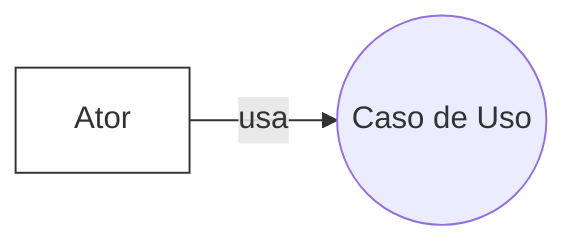

# Especificações do Projeto

Esta seção detalha como a solução Click Health foi especificada a partir da perspectiva do usuário. Partimos da Documentação de Contexto para decompor o problema em artefatos de análise e desenho centrados no usuário: personas, histórias de usuários, requisitos funcionais e não funcionais, restrições e casos de uso. O objetivo é garantir alinhamento entre necessidades reais (familiares, cuidadores e profissionais de saúde) e o escopo de implementação da primeira versão do sistema.


## Personas

As personas abaixo representam grupos típicos de usuários do ecossistema de cuidado domiciliar: cuidadores familiares principais, cuidadores de apoio, cuidadores profissionais e o paciente (usuário indireto). Cada persona descreve angústias, frustrações e expectativas diretamente relacionadas ao problema de organizar e compartilhar o cuidado. Também definimos uma aparência verossímil (imagem ilustrativa) para facilitar empatia e tomada de decisão de design.


|APARÊNCIA| NOME |DESCRIÇÃO                 |
|--------------------|------------------------------------|----------------------------------------|
|  |  Maria Clara Andrade          |   Maria Clara é uma mulher da geração Baby Boomer, simpática e muito ligada à família. Vive com o marido e depende do apoio dos filhos para a rotina de consultas e medicação. Apesar de usar o celular, sente dificuldade com tecnologias complexas.  <br>- Idade: 67 anos </br> - Profissão: Aposentada (professora) </br> - Localização: Belo Horizonte, MG</br> - Formação: Pedagogia </br> Objetivo: Ter suporte confiável no gerenciamento de medicamentos e consultas médicas.</br> |
|<b> APARÊNCIA - DESCRIÇÃO VISUAL| <b>DORES | <b> EXPECTATIVA           |
| Mulher de cabelos grisalhos, pele clara, óculos discretos, sorriso gentil, estilo casual com blusa clara e colar simples. |  Medo de esquecer horários de medicamentos ou consultas.<br> Dificuldade de comunicação com todos os cuidadores, que trocam mensagens por canais diferentes.<br> Ansiedade por não saber quem está acompanhando suas necessidades diárias          |     Aplicativo simples e acessível, com lembretes claros. <br> Interface com botões grandes e mensagens fáceis de entender. <br> Tranquilidade em saber que seus filhos e netos estão coordenados em tempo real.         |

|APARÊNCIA| NOME |DESCRIÇÃO                 |
|--------------------|------------------------------------|----------------------------------------|
|  |    Lucas Henrique Moura      |  Lucas é da geração Z, curioso e acostumado com tecnologia. Usa o celular para quase tudo e quer contribuir no cuidado do avô, organizando tarefas simples como acompanhar horários de medicação e alertar os cuidadores mais velhos.  <br>- Idade: 18 anos </br> - Profissão: Estudante  </br> - Localização: Rio de Janeiro, RJ </br> - Formação: Início da graduação em Administração  </br> Objetivo: Ajudar os pais no cuidado do avô com Alzheimer.</br> |
|<b> APARÊNCIA - DESCRIÇÃO VISUAL| <b>DORES | <b> EXPECTATIVA           |
| Rapaz jovem, pele morena, cabelo ondulado curto, camiseta preta, mochila esportiva e fone sem fio. | Falta de clareza sobre o que já foi feito pelos outros cuidadores. <br> Frustração com atrasos e falhas na comunicação em grupo. Ansiedade para contribuir de forma mais efetiva no cuidado familiar. <br>           |    Aplicativo moderno e intuitivo, com interface próxima das redes sociais.  <br>   Alertas e feedback visual sobre as tarefas realizadas.      |


|APARÊNCIA| NOME |DESCRIÇÃO                 |
|--------------------|------------------------------------|----------------------------------------|
|    |     João Pedro Lima     |  João é da geração Millennial. Conectado, prático e multitarefa, trabalha em home office e organiza parte da rotina de saúde da mãe. É responsável pelos agendamentos e comunicação com profissionais de saúde.   <br>- Idade: 38 anos  </br> - Profissão: Engenheiro  </br> - Localização: São Paulo, SP </br> - Formação: Engenharia da Computação </br> Objetivo: Integrar tecnologia e organização para cuidar da mãe idosa.|
|<b> APARÊNCIA - DESCRIÇÃO VISUAL| <b>DORES | <b> EXPECTATIVA           |
| Homem jovem, cabelo castanho curto, pele clara, barba por fazer, camisa polo azul e smartwatch no pulso. | Falta de integração de informações em um único sistema. <br> Perda de tempo conferindo mensagens e e-mails em múltiplos canais. <br>  Ansiedade em caso de emergências quando não está fisicamente presente         |    Painel centralizado para organizar compromissos e alertas.  <br> Confiabilidade nas notificações e histórico atualizado em tempo real. <br>   Recursos que permitam monitorar tudo mesmo à distância.     |

 
|APARÊNCIA| NOME |DESCRIÇÃO                 |
|--------------------|------------------------------------|----------------------------------------|
|  |      Gabriela Santos    |  Gabriela é da geração Millennial/Z. Empática, dedicada e organizada, atende até 8 pacientes diariamente. Precisa de ferramentas rápidas que facilitem o registro de informações clínicas durante os atendimentos.   <br>- Idade: 28 anos  </br> - Profissão: Enfermeira home care </br> - Localização: Belo Horizonte, MG </br> - Formação: Enfermagem  </br> Objetivo: Registrar informações de saúde de pacientes de forma prática e padronizada.
</br> |
|<b> APARÊNCIA - DESCRIÇÃO VISUAL| <b>DORES | <b> EXPECTATIVA           |
| Mulher jovem, pele morena clara, cabelo castanho preso em coque, uniforme branco com jaleco limpo e estetoscópio no pescoço. | Falta de padronização na comunicação entre cuidadores da mesma família.  <br> Dificuldade para registrar e atualizar informações rapidamente no celular. <br>  Necessidade de histórico confiável para embasar decisões médicas.         |  Interface prática e rápida para registrar doses, sintomas e orientações médicas.    <br>   Histórico organizado e acessível para todos os cuidadores. <br>  Redução de falhas de comunicação entre profissionais e familiares.    |

 
|APARÊNCIA| NOME |DESCRIÇÃO                 |
|--------------------|------------------------------------|----------------------------------------|
|  |  Helena Martins        |  Helena é da geração X, profissional, focada em resultados, mas com sensibilidade para lidar com idosos e famílias. Busca ferramentas seguras para acessar informações confiáveis sem burocracia.   <br>- Idade: 45 anos  </br> - Profissão: Médica </br> - Localização: Porto Alegre, RS </br> - Formação: Medicina, especialização em geriatria  </br> Objetivo: Acompanhar remotamente o histórico de saúde dos pacientes. </br> |
|<b> APARÊNCIA - DESCRIÇÃO VISUAL| <b>DORES | <b> EXPECTATIVA           |
| Mulher de pele clara, cabelo castanho médio, jaleco branco elegante, óculos de grau, postura confiante.  | Dificuldade em consolidar informações enviadas por múltiplos cuidadores. <br> Perda de tempo pedindo dados ou atualizações por canais informais. <br>           |  Plataforma confiável com relatórios completos e exportáveis.    <br>    Interface simples para acesso rápido a históricos e atualizações.     |

Combase nas personas apresentadas podemos identificar o público-alvo do projeto abrange diversos perfis de usuários dentro do ecossistema de cuidado domiciliar de saúde, sendo eles:

Cuidadores familiares principais: geralmente filhos, cônjuges ou outros parentes próximos que assumem a coordenação do cuidado de um paciente. São usuários que criarão as contas no sistema, cadastrarão os pacientes sob seus cuidados e gerenciarão as informações principais. Em muitos casos, podem ser indivíduos de meia-idade responsáveis por pais idosos, ou mães/pais de crianças com necessidades especiais de saúde. Esse perfil busca uma ferramenta para organizar todas as tarefas de cuidado, compartilhar responsabilidades com outros familiares e acompanhar de perto a situação de saúde do paciente.

Cuidadores familiares secundários ou de apoio: incluem outros parentes, amigos próximos ou vizinhos que auxiliam no cuidado, porém não centralizam as decisões. Também engloba cuidadores informais que ajudam eventualmente (por exemplo, irmãos que revezam turnos de cuidado, netos auxiliando avós, etc.). Esse público necessita acessar informações atualizadas sobre o paciente, cumprir tarefas designadas (como levar a consultas ou administrar medicação em determinados horários) e comunicar aos demais qualquer observação relevante, mesmo que não estejam envolvidos no dia a dia constantemente.

Cuidadores profissionais contratados: profissionais de saúde ou cuidadores formais (por exemplo, técnicos de enfermagem, home care) que são contratados pela família para prover assistência ao paciente em casa. Embora não sejam membros da família, eles precisam integrar-se ao Click Health do paciente. Para esses usuários, o sistema oferece acesso às rotinas e históricos médicos necessários para desempenhar seu trabalho de forma informada, além de permitir registro de ocorrências ou observações durante seus turnos (conforme as permissões concedidas pela família).

Paciente (usuário indireto): o paciente em si, quando tiver condições cognitivas e físicas, também é beneficiário e potencial usuário indireto do sistema. Por exemplo, um idoso que use smartphones poderia consultar sua própria agenda de medicamentos e ser notificado, aumentando sua autonomia. Contudo, na maioria dos cenários o paciente será o sujeito do cuidado e não operará diretamente o sistema; ainda assim, todo o desenho da solução é centrado em melhorar a assistência e, portanto, o paciente é a figura central a ser beneficiada pelo uso coordenado da plataforma pelos cuidadores.


## Histórias de Usuários

As histórias de usuários traduzem as necessidades das personas em funcionalidades observáveis.
Essas histórias servem como ponte entre o problema e os requisitos do sistema, permitindo refinar critérios de aceite, dependências e riscos. 
Com base na análise das personas forma identificadas as seguintes histórias de usuários:

|EU COMO... `PERSONA`| QUERO/PRECISO ... `FUNCIONALIDADE` |PARA ... `MOTIVO/VALOR`                 |
|--------------------|------------------------------------|----------------------------------------|
| Cuidador familiar principal |     Cadastrar múltiplos pacientes na minha conta para gerenciar em um só lugar os cuidados de todos os meus familiares dependentes.       |      facilitar a organização e acesso às informações.          |
|   Cuidador familiar principal    |       consultar um log de auditoria que mostre todas as edições feitas nos dados do paciente (quem alterou, o quê e quando)           | ter transparência sobre as modificações e poder esclarecer quaisquer divergências de informação que apareçam. |
| Cuidador familiar principal |     compartilhar o perfil de um paciente com outros cuidadores definindo se cada um pode editar ou apenas visualizar os dados       |       dividir responsabilidades com segurança e sem expor dados além do necessário         |
|   Cuidador |           agendar consultas, exames e horários de medicação no sistema, incluindo lembretes automáticos       | esquecer compromissos importantes nem doses de medicamentos, melhorando a adesão ao tratamento do paciente. | 
| Cuidador | receber notificações no meu celular ou e-mail antes dos horários críticos (como lembrete de dar um medicamento ou da aproximação de uma consulta)  | antecipar e preparar o que for necessário, reduzindo o risco de falhas no cuidado.           |     
| Cuidador profissional          | registrar no histórico do paciente qualquer alteração ou observação clínica | que essa informação fique documentada e disponível imediatamente a todos os cuidadores envolvidos.|
|  Cuidador de apoio                | visualizar um feed de atualizações recentes do paciente ao entrar no aplicativo | inteirar rapidamente do que aconteceu nos últimos dias (como novos medicamentos iniciados ou eventos adversos), sem precisar ligar para o cuidador principal para pedir um resumo. |  

Apresente aqui as histórias de usuário que são relevantes para o projeto de sua solução. As Histórias de Usuário consistem em uma ferramenta poderosa para a compreensão e elicitação dos requisitos funcionais e não funcionais da sua aplicação. Se possível, agrupe as histórias de usuário por contexto, para facilitar consultas recorrentes à essa parte do documento.


## Requisitos

Com base nas histórias de usuários foram definidos os requisitos funcionais e não funcionais para elaboração do sistema. Os requisitos funcionais definem o que o Click Health deve fazer (cadastros, agenda, notificações, histórico, feed, auditoria, autenticação e exportações). Os requisitos não funcionais definem como essas funções devem se comportar (segurança/LGPD, usabilidade/acessibilidade, desempenho, disponibilidade, escalabilidade e confiabilidade).
As priorizações seguem o critério Alta / Média / Baixa e foram orientadas pelas personas e histórias com maior impacto na primeira versão — em especial organização do cuidado, comunicação entre cuidadores e segurança da informação.

As tabelas que se seguem apresentam os requisitos funcionais e não funcionais que detalham o escopo do projeto.

### Requisitos Funcionais

|ID    | Descrição do Requisito  | Prioridade |
|------|-----------------------------------------|----|
|RF-001|Cadastrar, visualizar, atualizar e excluir (CRUD)* múltiplos pacientes por usuário, permitindo que um cuidador gerencie diversos perfis sob sua conta. | Alta | 
|RF-002| Compartilhar o acesso de cada paciente com outros usuários e    | Alta |
|RF-003| Permitir o usuário configurar permissões (somente leitura ou leitura/escrita) por paciente. | Alta  |
|RF-004| Registrar compromissos de saúde (consultas, exames)  | Alta | 
|RF-005|  Programar horários de medicação por paciente, com lembretes e alertas de compra de insumos.  | Alta  |
|RF-006| Enviar notificações/alertas a cuidadores sobre eventos agendados, com lembretes configuráveis. | Alta |
|RF-007| Registrar (CRUD)* histórico clínico por paciente: alterações de medicação (com data e responsável), resultados de exames, internações e anotações clínicas. | Alta | 
|RF-008|  Exibir feed de atualizações por paciente, em ordem cronológica, com registro automático de ações.  | Alta |
|RF-009| Manter trilha de auditoria (CRUD)* de operações em dados do paciente (quem, o que, quando, antes/depois). | Alta |
|RF-010| Autenticar usuários com login seguro e gerenciar convites (CRUD) e revogação de acessos por paciente.| Alta | 
|RF-011| Editar (CRUD)* dados cadastrais do paciente (nome, data de nascimento, contatos, informações médicas básicas), respeitando permissões.   | Média |
|RF-012| Gerar relatórios / exportar dados do paciente (PDF/CSV/ZIP com anexos) para compartilhar com profissionais. | Média |

*CRUD: criar, ler, atualizar ou excluir dados.

### Requisitos não Funcionais

|ID     | Descrição do Requisito  |Prioridade |
|-------|-------------------------|----|
|RNF-001| Segurança e Privacidade: O sistema deve proteger os dados sensíveis de saúde armazenados em conformidade com a LGPD (Lei Geral de Proteção de Dados).| Alta | 
|RNF-002| Usabilidade e Acessibilidade: A interface do usuário deve ser intuitiva e de fácil navegação, considerando que muitos cuidadores não têm treinamento técnico. Devem ser seguidas diretrizes de design acessível (por exemplo, contraste adequado, fontes legíveis, suporte a leitores de tela) para atender também usuários com eventuais limitações visuais ou motoras. | Alta  | 
|RNF-003| Disponibilidade: O sistema deve ter alta disponibilidade, visando estar acessível 24 horas por dia, 7 dias por semana, já que os cuidados de pacientes ocorrem continuamente. Manutenções programadas devem ser comunicadas antecipadamente e minimizadas para não prejudicar o acompanhamento dos pacientes. | Alta | 
|RNF-004| Desempenho: As principais funções (carregar o perfil do paciente, atualizar o feed, salvar um novo registro) devem ocorrer com rapidez. O sistema deve suportar simultaneamente diversos cuidadores acessando informações de um mesmo paciente sem degradação perceptível de desempenho. | Média  | 
|RNF-005| Escalabilidade: A solução deve ser desenvolvida com arquitetura escalável, capaz de suportar um aumento no número de usuários e de dados ao longo do tempo. Isso implica usar boas práticas de desenvolvimento para que o sistema mantenha desempenho adequado. | Média | 
|RNF-006| Portabilidade e Facilidade de Acesso: O sistema deve ser acessível diretamente via navegador de internet, funcionando em computadores, smartphones e tablets, sem necessidade de instalação complexa, garantindo praticidade para cuidadores e pacientes. | Média  | 
|RNF-007| Manutenibilidade e Evolutividade: O software deve ser desenvolvido seguindo padrões de código e arquitetura que facilitem sua manutenção e evolução. Isso inclui documentação clara, modularização de componentes e uso de frameworks conhecidos.  | Baixa | 
|RNF-008| Confiabilidade dos Dados: Além da segurança, o sistema deve garantir integridade transacional – por exemplo, se dois usuários tentarem editar simultaneamente a mesma informação, deve haver controle de concorrência para evitar inconsistências. Os registros de auditoria não podem ser alterados indevidamente, assegurando confiabilidade em quem fez cada alteração. | Alta  | 
|RNF-009| Backup e Recuperação de Dados: O sistema deve manter cópias de segurança periódicas das informações dos pacientes e possibilitar a restauração em caso de falha ou perda. | Alta |  

Além do escopo desejado, o projeto observa restrições de prazo, tecnologia e integração que limitam a solução nesta fase.
## Restrições

As restrições delimitam o que não será feito nesta versão, considerando tempo, equipe e tecnologias disponíveis. Elas ajudam a alinhar expectativas, orientar decisões de arquitetura e reduzir riscos. As restrições listadas a seguir podem ser reavaliadas em ciclos posteriores, conforme maturidade do produto, feedback e disponibilidade de recursos.

O projeto está restrito pelos itens apresentados na tabela a seguir.

|ID| Restrição                                             |
|--|-------------------------------------------------------|
|01| O projeto deverá ser entregue até o final do semestre |
|02| Não será desenvolvido um módulo de backend completo nesta fase; o sistema funcionará com armazenamento local (LocalStorage ou banco em nuvem simples).      |
|03| O escopo inicial não contemplará integrações externas com sistemas de saúde        |
|04| O sistema não deverá funcionar offline .        |
|05| O design da interface deverá seguir padrões minimalistas e de fácil usabilidade.        |
|06| O projeto deverá ser desenvolvido utilizando apenas tecnologias já dominadas pela equipe (HTML, CSS, C#).        |
|07| A segurança será básica, com autenticação simples (e-mail e senha).        |

Com escopo e fronteiras definidos, o próximo passo é modelar os casos de uso que conectam atores (perfis) às funcionalidades principais.

## Diagrama de Casos de Uso


## 0) O que é um Diagrama de Casos de Uso (UML) e para que serve
Um **Diagrama de Casos de Uso** modela o que o sistema oferece aos atores, mostrando funcionalidades observáveis e o limite do sistema. Ajuda a alinhar stakeholders, definir escopo e orientar testes de aceitação.
**Como foi feito:** aplicamos essa definição ao contexto do Click Health para guiar escolhas de atores e casos.

## 1) Referências utilizadas (base do diagrama)
- Documento do projeto Click Health: Perfis, Histórias, RF-01…RF-10, RNF, Justificativa e Metodologia.
- Boas práticas de UML: uso de `<<include>>`/`<<extend>>`.
- Contexto de saúde: coordenação do cuidado, notificações, auditoria.
**Como foi feito:** extraímos entidades e funcionalidades do documento e validamos com boas práticas UML.

## 2) Atores
- Cuidador Familiar Principal — administra pacientes, acessos e configurações.
- Cuidador de Apoio — executa tarefas delegadas e registra ocorrências.
- Cuidador Profissional — registra evolução clínica e execução de rotinas.
- Paciente (ator secundário/indireto) — pode visualizar agenda/notificações quando aplicável.
- Serviço de Notificações (externo/opcional) — e-mail/SMS/push.
**Como foi feito:** derivamos dos Perfis de Usuário e da integração de notificações.

## 3) Como o diagrama foi construído (rastreabilidade)
1. Perfis → atores.
2. Histórias → macrofunções (CRUD, Permissões, Agenda/Medicação, Notificações, Histórico, Feed, Auditoria, Autenticação, Relatórios).
3. RF-01…RF-10 → casos de uso correspondentes.
4. `include`/`extend` → subfunções obrigatórias e comportamentos condicionais.
5. Associação atores ↔ casos.
6. Notas de projeto (auditoria, concorrência, escopo).
**Como foi feito:** garantimos rastreabilidade RF ↔ História ↔ Caso de uso.

## 4) Casos de Uso (resumo)
### Autenticação e Acesso
- Autenticar-se (todos)
- Gerenciar Convites e Acessos (inclui: Enviar Convite, Definir Permissões, Revogar Acesso)
- Consultar Log de Auditoria
### Gestão de Pacientes
- Gerenciar Pacientes (CRUD) (inclui: Cadastrar, Editar, Excluir, Consultar)
- Exportar/Emitir Relatório do Paciente
### Agenda, Tarefas e Notificações
- Gerenciar Agenda do Paciente (inclui: Agendar Consulta, Agendar Exame, Planejar Medicação, Lembretes de Reposição/Compra)
- Receber Notificações/Alertas (estende: Gerenciar Agenda)
- Marcar Tarefa como Concluída
### Registros Clínicos e Comunicação
- Registrar Histórico Clínico (inclui: Anexar Exame, Registrar Ocorrência, Atualizar Medicações)
- Visualizar Feed de Atualizações
**Como foi feito:** agrupamos por objetivo e detalhamos subcasos com `include`/`extend`.

## Sobre Mermaid e PlantUML
**Visão geral (para quem está começando):**
- **Mermaid** é uma linguagem de diagramas em Markdown. O GitHub renderiza automaticamente o diagrama quando você abre o `.md`. Ótima para documentação rápida e colaboração, sem instalar nada. Limitação: não é UML “pura” — certos conceitos (ex.: `<<include>>`/`<<extend>>`) precisam ser representados de forma aproximada.
- **PlantUML** é uma linguagem textual pensada para **UML**. É forte em precisão semântica (tem `<<include>>` e `<<extend>>` nativos) e gera **PNG/SVG** de alta qualidade. Precisa de um renderizador (VS Code + extensão, site ou linha de comando).

**Quando usar qual?**
- Use **Mermaid** quando quiser um `.md` que renderiza direto no GitHub.
- Use **PlantUML** quando precisar de fidelidade UML e imagens para relatório/Canva.

**Como renderizar**
- **Mermaid**: mantenha o bloco ```mermaid em um `.md`. Para baixar PNG/SVG, use o **Mermaid Live Editor** (cole o código e exporte).
- **PlantUML**: abra o `.puml` no VS Code com a extensão PlantUML e use *Export*; ou use o site oficial/CLI para gerar PNG/SVG.

**Armadilhas comuns**
- Mermaid: sempre use cercas de código ` ```mermaid ` e defina a direção (`flowchart LR|TD`). Evite temas que o GitHub não reconheça.
- PlantUML: comece com `@startuml` e termine com `@enduml`; use alias (ex.: `as A1`) para nomes com espaço; `extend` usa `UC_A <|.. UC_B`.

**Mini‑cheatsheet**
Mermaid (use‑case via flowchart):


# PlantUML (básico + include/extend)

```plantuml
@startuml
actor "Usuário" as U
usecase UC as "Autenticar-se"
U -- UC

UC_A <<include>> UC_B
UC_C <|.. UC_D : <<extend>>
@enduml


flowchart LR
  A1["Cuidador Familiar Principal"]
  A2["Cuidador de Apoio"]
  A3["Cuidador Profissional"]
  A4["Paciente (indireto)"]
  Ext["Serviço de Notificações"]

  UC_auth["Autenticar-se"]
  UC_access["Gerenciar Convites e Acessos"]
  UC_crud["Gerenciar Pacientes (CRUD)"]
  UC_agenda["Gerenciar Agenda do Paciente"]
  UC_notify["Receber Notificações/Alertas"]
  UC_task["Marcar Tarefa como Concluída"]
  UC_hist["Registrar Histórico Clínico"]
  UC_feed["Visualizar Feed de Atualizações"]

  A1 --> UC_auth
  A2 --> UC_auth
  A3 --> UC_auth
  A1 --> UC_access
  A1 --> UC_crud
  A1 --> UC_agenda
  A2 --> UC_task
  A2 --> UC_feed
  A2 --> UC_notify
  A3 --> UC_hist
  A3 --> UC_task
  A3 --> UC_feed
  A3 --> UC_notify
  A4 --> UC_notify
  A4 --> UC_feed
  Ext --> UC_notify

  UC_agenda -.-> UC_notify


### 5.2 PlantUML
```plantuml
@startuml
left to right direction
actor "Cuidador Familiar Principal" as A1
actor "Cuidador de Apoio" as A2
actor "Cuidador Profissional" as A3
actor "Paciente (indireto)" as A4
actor "Serviço de Notificações" as Ext

rectangle "Click Health" {
  usecase UC_auth as "Autenticar-se"
  usecase UC_access as "Gerenciar Convites e Acessos"
  usecase UC_invite as "Enviar Convite"
  usecase UC_perm as "Definir Permissões"
  usecase UC_revoke as "Revogar Acesso"
  usecase UC_audit as "Consultar Log de Auditoria"

  usecase UC_crud as "Gerenciar Pacientes (CRUD)"
  usecase UC_cad as "Cadastrar Paciente"
  usecase UC_edit as "Editar Paciente"
  usecase UC_del as "Excluir Paciente"
  usecase UC_view as "Consultar Dados"
  usecase UC_report as "Exportar/Emitir Relatório do Paciente"

  usecase UC_agenda as "Gerenciar Agenda do Paciente"
  usecase UC_cons as "Agendar Consulta"
  usecase UC_exam as "Agendar Exame"
  usecase UC_med as "Planejar Medicação"
  usecase UC_buy as "Lembretes de Reposição/Compra"
  usecase UC_notify as "Receber Notificações/Alertas"
  usecase UC_task as "Marcar Tarefa como Concluída"

  usecase UC_hist as "Registrar Histórico Clínico"
  usecase UC_attach as "Anexar Resultado de Exame"
  usecase UC_occ as "Registrar Ocorrência/Observação"
  usecase UC_rx as "Atualizar Medicações"
  usecase UC_feed as "Visualizar Feed de Atualizações"
}

A1 -- UC_auth
A2 -- UC_auth
A3 -- UC_auth
A1 -- UC_access
A1 -- UC_audit
A1 -- UC_crud
A1 -- UC_report
A1 -- UC_agenda
A2 -- UC_task
A2 -- UC_feed
A2 -- UC_notify
A3 -- UC_hist
A3 -- UC_task
A3 -- UC_feed
A3 -- UC_notify
A4 -- UC_notify
A4 -- UC_feed
Ext -- UC_notify
UC_access <<include>> UC_invite
UC_access <<include>> UC_perm
UC_access <<include>> UC_revoke
UC_crud <<include>> UC_cad
UC_crud <<include>> UC_edit
UC_crud <<include>> UC_del
UC_crud <<include>> UC_view
UC_hist <<include>> UC_attach
UC_hist <<include>> UC_occ
UC_hist <<include>> UC_rx
UC_agenda <|.. UC_notify : <<extend>> (alerta/horário)
@enduml
```
**Como foi feito:** Mermaid para visualização imediata no GitHub; PlantUML para semântica de `include/extend` mais precisa.

## 6) Matriz Ator × Caso de Uso (copiável)
### Tabela (visual)
| Caso de Uso | Cuidador Principal | Cuidador de Apoio | Cuidador Profissional | Paciente |
|---|:--:|:--:|:--:|:--:|
| Autenticar-se | ✅ | ✅ | ✅ |  |
| Gerenciar Convites e Acessos | ✅ |  |  |  |
| Consultar Log de Auditoria | ✅ |  |  |  |
| Gerenciar Pacientes (CRUD) | ✅ |  |  |  |
| Exportar/Emitir Relatório | ✅ |  |  |  |
| Gerenciar Agenda do Paciente | ✅ |  |  |  |
| Marcar Tarefa como Concluída |  | ✅ | ✅ |  |
| Receber Notificações/Alertas | ✅ | ✅ | ✅ | ✅* |
| Registrar Histórico Clínico | ✅ |  | ✅ |  |
| Visualizar Feed de Atualizações | ✅ | ✅ | ✅ | ✅* |
### CSV (para planilha)
```csv
Caso de Uso,Cuidador Principal,Cuidador de Apoio,Cuidador Profissional,Paciente
Autenticar-se,Sim,Sim,Sim,
Gerenciar Convites e Acessos,Sim,,,
Consultar Log de Auditoria,Sim,,,
Gerenciar Pacientes (CRUD),Sim,,,
Exportar/Emitir Relatório,Sim,,,
Gerenciar Agenda do Paciente,Sim,,,
Marcar Tarefa como Concluída,,Sim,Sim,
Receber Notificações/Alertas,Sim,Sim,Sim,Sim*
Registrar Histórico Clínico,Sim,,Sim,
Visualizar Feed de Atualizações,Sim,Sim,Sim,Sim*
```
**Como foi feito:** marcamos responsabilidades conforme perfis/histórias; as entradas com * dependem do paciente interagir.

## 7) Observações de Regras
- Permissões: convites e escopo por paciente; leitura vs. edição.
- Auditoria: trilha imutável para criar/editar/excluir.
- Notificações: disparo por agenda/medicação com antecedência.
- Concorrência: lock otimista / última versão.
**Como foi feito:** derivado de RNF e contexto de segurança/saúde.

## 8) Próximos Passos
1. Confirmar Paciente como ator (app/portal).
2. Decidir granularidade (macro vs. subcasos).
3. Exportar PNG/SVG dos diagramas.
4. Definir critérios de aceitação por caso de uso.
**Como foi feito:** backlog baseado nas dúvidas de escopo e entregáveis.
